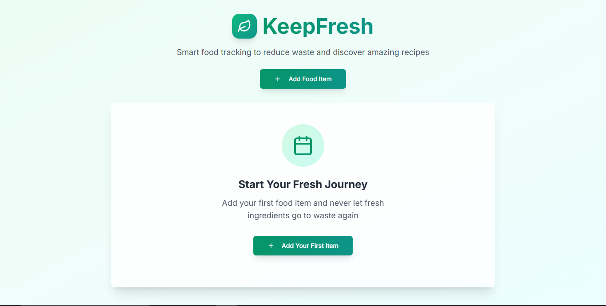

[](https://keepfresh.vercel.app/)

# KeepFresh - Food Expiry Tracker

A modern web application I built to help you track food expiration dates and reduce food waste.

[](https://nextjs.org/)
[](https://www.typescriptlang.org/)

## Overview

KeepFresh is a smart food expiry tracking application I created to help you keep track of your groceries and their expiration dates. Never let food go to waste again with timely notifications and an intuitive interface.

## Features

- 📅 Track expiration dates for all your food items
- 🔔 Get notified before items expire
- 📱 Responsive design for desktop and mobile
- 🍽️ Recipe suggestions for items nearing expiry
- 📊 Visual dashboard to manage your inventory

## Tech Stack

- **Frontend**: Next.js 14, React, TypeScript
- **Styling**: Tailwind CSS, shadcn/ui components
- **Database**: Supabase
- **Package Manager**: pnpm

## Getting Started

1. Clone the repository

```bash
git clone https://github.com/your-username/keepfresh.git
cd keepfresh
```

2. Install dependencies

```bash
pnpm install
```

3. Set up environment variables

```bash
cp .env.example .env.local
```

4. Run the development server

```bash
pnpm dev
```

5. Open [http://localhost:3000](http://localhost:3000) in your browser

## How It Works

1. Add food items with their expiration dates
2. View your inventory in an organized dashboard
3. Receive notifications for items nearing expiry
4. Get recipe suggestions to use up expiring items
5. Mark items as consumed or disposed of

## Contributing

Feel free to submit issues and pull requests to help improve KeepFresh!

## Credits

Created by [Naman](https://github.com/NamanOG) with help from [v0.dev](https://v0.dev).
